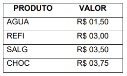
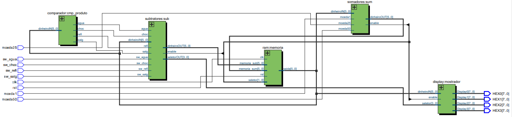

# MaquinaDeVendas

Projeto apresentado para obtenção de nota parcial na disciplina de circuítos digitais, da Universidade Tecnológica Federal do Paraná, campus Apucarana.

Prof. Erinaldo Pereira

---

O projeto foi desenvolvido em uma placa DE10-Lite da terasic, seu chip principal é o MAX10 da Altera. Foi utilizado o software Quartus Prime 20.1 para o desenvolvimento do chip, utilizando VHDL como linguagem principal.

É possível escolher entre quatro produtos, com preços pré determinados:

As moedas aceitas são de R$: 0.25, 0.50 e 1. A medida que o valor é incrementado, é mostrado no display e as opções de compra são liberadas.

---

O esquemático das ligações internas do chip:

